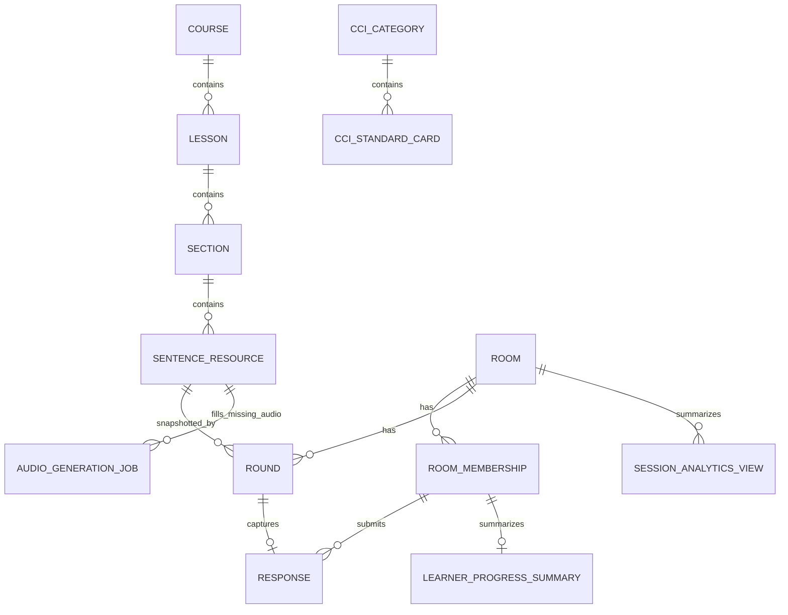

# Data Model: CHUNKS Mirror / Offline Live Room Frontend



## Course
- `id`, `title`, `status`, `created_at`, `updated_at`

## Lesson
- `id`, `course_id`, `title`, `order_index`, `status`

## Section
- `id`, `lesson_id`, `title`, `order_index`, `status`

## Sentence Resource
- `id`, `course_id`, `lesson_id`, `section_id`
- `sentence_code`, `text_en`, `text_vi`
- `audio_en_url`, `audio_vi_url`
- `cvr_value` (CVR Ω)
- `approval_status`: draft / approved / archived
- `order_index`, `created_at`, `updated_at`

Validation: Teacher scopes can only use approved resources; approved resources require `cvr_value`. Teacher screens may display full EN/VI prompt text; learner live-room screens display only `sentence_code`, status, and eligibility while relying on teacher-controlled classroom audio.

## CCI Category
- `id`, `label`, `description`, `status`

## CCI Standard Card
- `id`, `category_id`, `label`, `description`, `cci_standard_x`, `is_default`, `status`

Validation: Teacher can select active cards only; at most one default card per category should be active.

## Room / Live Session
- `id`, `room_code`, `teacher_host_id`
- `resource_scope_filter`, `ordered_sentence_resource_ids_snapshot`
- `default_response_capture_mode`: assigned / first_responder / auto_rotate
- `scoring_mode`: simple / timed
- `scoring_settings_snapshot`
- `status`: lobby / round_open / round_closed / finished
- `created_at`, `finished_at`

State: lobby → round_open → round_closed → round_open; lobby/round_closed → finished; finished is terminal.

## Room Membership
- `id`, `room_id`, `auth_user_id`, `display_name`, `role`, `joined_at`, `status`

## Round / Sentence Window
- `id`, `room_id`, `sentence_resource_id`, `round_index`
- `status`: draft / open / closed
- `response_capture_mode_snapshot`, `assigned_learner_id`, `captured_learner_id`
- `cci_standard_x_snapshot`, `cvr_value_snapshot`, `opened_at`, `closed_at`
- Playback UI snapshot: selected audio language (`en` / `vi` / `none`), current sequence index, and optional playback status are client/UI state unless persisted by a later migration.

Validation: open rounds require scoring/CVR snapshots; assigned mode requires assigned learner before learner response. Keyboard advance is allowed only after a finalized response exists for the round or after explicit teacher skip confirmation.

## Response
- `id`, `room_id`, `round_id`, `captured_learner_id`
- `response_color`: red / yellow / green
- `learner_performance_y`: 0 / 1 / 2 by default
- `reflection_time_ms`, `reflection_seconds`
- `cci_standard_x`, `cvr_value`, `cci_result`, `cpd_result`
- `scoring_mode_snapshot`, `formula_version_snapshot`, `captured_at`

Validation: MVP allows at most one tracked response per round; accepted only while round is open and learner is eligible.

## Learner Progress Summary
Derived by `room_id` + `learner_id`: `response_count`, `red_count`, `yellow_count`, `green_count`, `highest_cpd`, `total_cpd`, `average_cpd`, `average_reflection_seconds`, `last_response_at`.

## Audio Generation Job
- `id`, `resource_id`, `language`: en / vi
- `status`: queued / running / succeeded / failed / skipped
- `provider`, `model`, `storage_path`, `public_url`
- `error_message`, `requested_by`, `created_at`, `updated_at`, `completed_at`

Validation: Audio generation must run server-side or by secure operator script. Provider API keys are environment-only and must not be stored in database rows, browser state, or logs. Admin bulk generation queues one job per missing language and stores the intended object location in `storage_path` using `sentence-audio/{courseId}/{lessonId}/{sentenceCode}-{language}.mp3`; the secure worker/operator uploads the file and later writes `public_url` plus the resource `audio_en_url`/`audio_vi_url`.

## Session Analytics View
Derived by `room_id`, optionally grouped by `learner_id`: room title/code, resource count, completed rounds, response count, color counts, total/average/highest CPD, average reflection seconds, learner distribution, first/last response time.

Validation: Analytics are read-only derived views over durable rooms, rounds, responses, and progress summaries; they must not rewrite scoring history.

## Scoring Snapshot Rules
Simple mode:
```text
CCI = CCI Standard X × Learner Performance Y
CPD = CCI × CVR Ω
```
Every response stores the inputs and formula version used at capture time.
